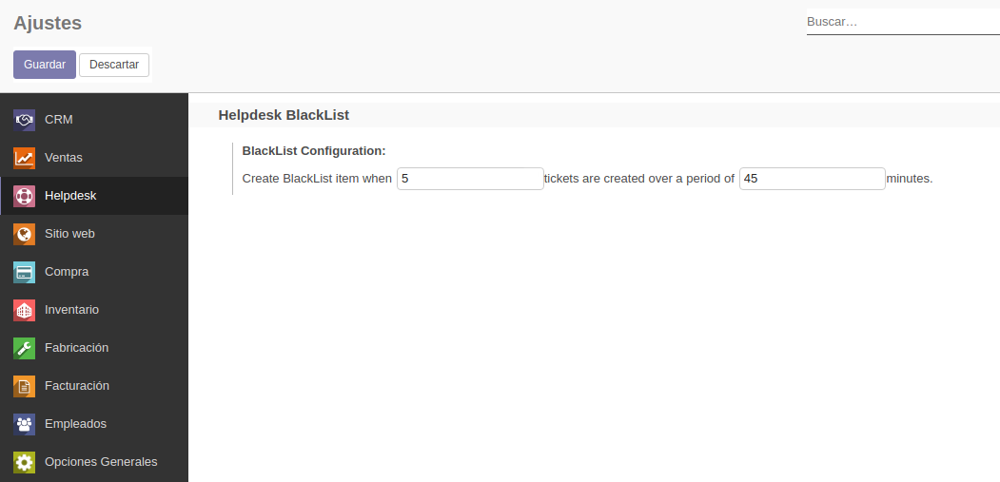

To configure this module, you need to:
#. Create the range of emails per minute.

-------------------
Settings
-------------------

#. Go to *Helpdesk > Configuration > Settings* to edit the range.
#. Edit the range of the Blacklist configuration.
#. Set the number of emails and the minutes.

